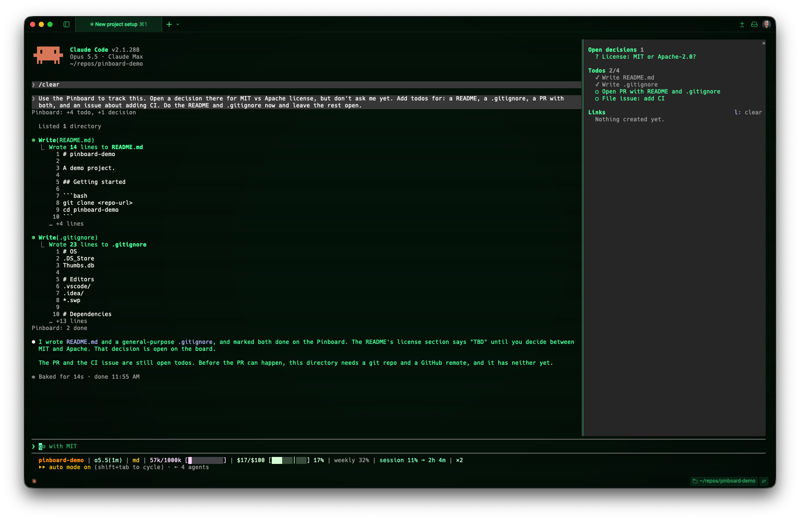

# Pinboard

[](https://mods.aidojo.si/#sirkitree--pinboard--pinboard) [](https://mods.aidojo.si/#sirkitree--pinboard--pinboard)

A Claude Code mod that keeps the things you need to act on in a sidebar pane, so they don't scroll out of view in the transcript.



The story of how it came together: [Pinboard: a Claude Code mod](https://jeradbitner.com/blog/pinboard-claude-code-mod).

## What it pins

- **Open decisions**: questions Claude needs you to answer. They stay pinned until Claude closes them after you answer.
- **Todos**: the session's task list, one action per item. The one Claude is working on is marked `▸` in the warning color (one at a time), open items show `○`, and finished items fold into a single dim `✓ N done` line so open work stays on top.
- **Links**: URLs from actions that make something (`gh pr|issue|release|repo|gist create`, `gh pr|issue comment`, `git push`, and MCP tools that create, draft, send, publish, share or upload), newest first, up to 12. GitHub PRs and issues get short labels such as `repo PR #12`. Press `l` (or the **clear** button) to empty the list.

Everything is session state: `/clear` and `/resume` start an empty board.

## How Claude updates it

Pinboard registers a tool, `mcp__pinboard__update`, that Claude calls to add todos, start one, check them off or remove them by id, open decisions, and close them. Its description carries a few working rules borrowed from opencode's `todowrite`: update in real time, mark a todo done only after the work (and any verification) is actually done, and when blocked, leave it in progress and add a follow-up todo for the blocker. Each call shows as one dim line in the transcript (`Pinboard: +2 todo, 1 decided`), so lists don't have to be repeated in replies.

The current board, with ids, is added to the end of the system prompt on every request, so Claude always knows what's open. Pinboard doesn't depend on the `TodoWrite` or Task tools, which newer models don't get by default.

## How it opens

- The pane opens by itself the first time something lands on an empty board.
- Opened that way, Claude Code only seats it in a terminal at least 144 columns wide (110 once you've opened it yourself). Below that, run `/pinboard`.
- `/pinboard` opens it at any width, even while Claude is working. Ctrl+X then X closes it.

## Install

```bash
claude plugin marketplace add sirkitree/pinboard
claude plugin install pinboard@pinboard
```

## Develop

```bash
claude plugin validate --strict .
claude plugin test .
claude --plugin-dir .
```

Built on the mods API as of Claude Code 2.1.288. That API is in early access and changes between releases.
